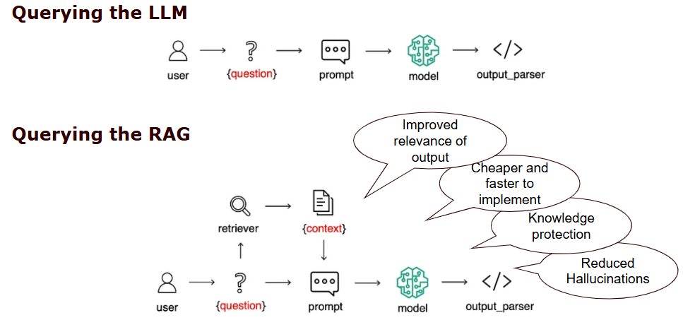
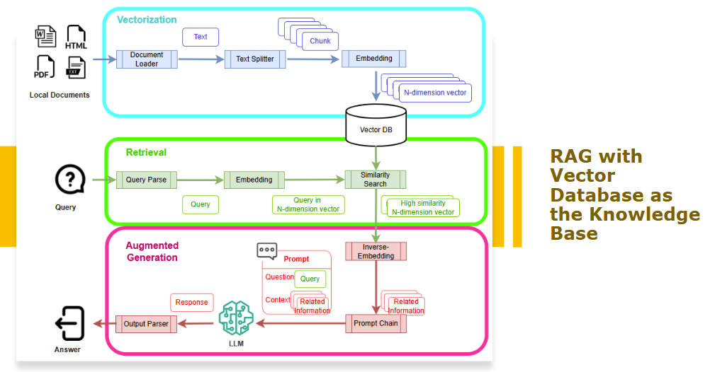
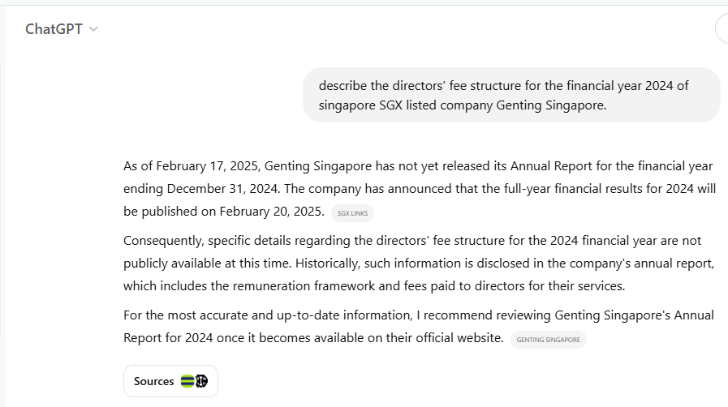
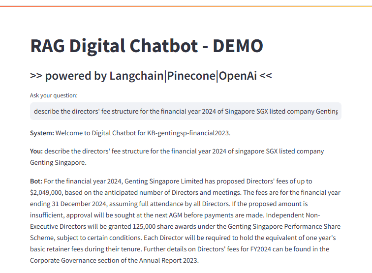

# Retrieval-Augmented-Generation-Digitalbot

This project demonstrates a simple implementation of Retrieval-Augmented Generation (RAG) using LangChain, Pinecone, and OpenAI to build a digitalbot capable of answering questions based on proprietary information. This approach enhances Large Language Models (LLM) by integrating real-time retrieval with text generation for more accurate responses.

## Introduction

Retrieval Augmented Generation (RAG) is a powerful technique that enhances the capabilities of Large Language Models (LLMs) by grounding them in external, factual data.  Think of it as giving your chatbot access to a vast library of information, allowing it to provide more accurate, relevant, and contextually appropriate responses. Instead of relying solely on the knowledge baked into its training data (which can be limited or outdated), a RAG-based chatbot can dynamically retrieve information from external sources like documents, databases, or APIs, and use that information to generate its responses.  This approach opens up a wide range of practical use cases, from customer service chatbots providing precise product details to healthcare chatbots offering up-to-date medical information.

## LLM Limitations

While LLMs possess impressive generative capabilities, they come with significant limitations.  Building, training, and maintaining these models is incredibly expensive, requiring vast computational resources and expertise.  Fine-tuning, while offering customization, also incurs substantial costs, making it prohibitive for small organizations or startups with limited funding.  Furthermore, both LLMs and their fine-tuned versions require constant retraining to incorporate updated data, adding another layer of expense and complexity. LLMs are trained on massive datasets, but these datasets are snapshots in time.  Therefore, trained LLM model is only knowledgeable with information that has emerged before the training, but not anything new nor any

It is always challenging to keep the LLM's knowledge base current and accurate.

## RAG Mechanism

RAG offers a compelling solution to overcome these LLM limitations. By decoupling the knowledge base from the LLM itself, RAG allows for more manageable and cost-effective knowledge updates.  Instead of retraining the entire LLM, updates can be made to the external knowledge base, which is significantly less resource-intensive. This approach allows the LLM to leverage external knowledge without requiring constant retraining, making it a more practical and scalable solution.


Diagram [reference](https://medium.com/@dminhk/retrieval-augmented-generation-rag-explained-b1dd89979681)

The RAG mechanism involves three key stages: **Knowledge Base Creation**, **Information Retrieval** and **Context-driven Prompt**

### RAG - Knowledge Base Creation (using Vector Datastore)

First, the data from various sources (documents, databases, etc.) is loaded and split into smaller, manageable chunks.  Each chunk is then converted into a numerical vector representation (embedding) using an embedding model. These vectorized chunks, along with metadata (e.g., source document, context), are stored in a vector database.  This database allows for efficient similarity searches.

### RAG - Information Retrieval

When a user poses a query, the same embedding model converts the query into a vector.  This query vector is then used to perform a similarity search against the vector database. As a result, set of relevant chunks of information that are "similar" to the query can be retrieved from the knowledge base. For example, if the query is about "car manufacturer", possible relevant information retrieved from the knowledge base may include "Honda", "Volvo" and "Mercedes-Benz"; but not "BMX" (for bicycle), "Yamaha" (for motorcycle) and "Boeing" (for airplanes).

The most similar chunks (based on the chosen similarity metric) are retrieved from the vector database. Several similarity search techniques are commonly employed, including:

- **Cosine Similarity**: Measures the angle between two vectors, with a smaller angle indicating higher similarity.
- **Dot Product**: Calculates the dot product of two vectors, which is related to cosine similarity.
- **Euclidean Distance**: Calculates the distance between two vectors, with a smaller distance indicating higher similarity. Often used after dimensionality reduction techniques like PCA.
- **Approximate Nearest Neighbor (ANN) Search**: Techniques like Locality Sensitive Hashing (LSH) or Hierarchical Navigable Small World (HNSW) graphs offer faster, though approximate, similarity searches, crucial for large datasets.

### RAG - Context-driven Prompt

The retrieved chunks of information from the similarity search, along with the original user query, are then combined to form a prompt. The relevant information from knowledge base forms the context of the prompt. The LLM then generates a response grounded in the provided context, leading to more accurate and informative answers.



---

## RAG - DigitalBot Implementation Using Streamlit

This project demonstrates the power of Retrieval Augmented Generation (RAG) by building a digitalbot that can answer questions about a recent financial report—data too new to be included in the training data of even the most up-to-date Large Language Models (LLMs).  I leveraged the LangChain framework, [Pincone](https://www.pinecone.io/) as the vector datastore, [OpenAI](https://platform.openai.com/) as the backend LLM, and Streamlit for rapid web application prototyping.

Alternative, feel free to explore other VectorStore solutions, such as [Milvus](https://milvus.io/) and [Chroma](https://www.trychroma.com/). Refer to [this reference](https://python.langchain.com/docs/how_to/local_llms/) for setting up and running a local LLM.

### Prerequisite

1. register for an API Key to OpenAI (require subscription fee)
2. register for an API Key to Pinecone (free)

### Setup
1. Clone the repository to your local
2. Create a virtual environment
```
python -m venv ragvenv
```
3. Activate the virtual environment
```
.\ragvenv\Scripts\activate
```
4. Install the libraries in the requirements.txt
```
pip install -r requirements.txt
```
5. Replace the API key in*.env*
```
OPENAI_API_KEY=[API KEY FROM OPENAI]
PINECONE_API_KEY=[API KEY FROM PINCONE]
```
6. Replace the PDF of your choice. 


### In Action

***ChatGPT does not have the latest financial report. Despite an effort to lookup through the Internet, there is no answer given to the question***


***My RAG digitalbot can accurately point out the information (retrieved from the financial report, i.e. local knowledge base)***



---

## Conclusion
This implementation demonstrates the power of RAG.  By decoupling the knowledge base (the financial report) from the LLM, the chatbot's knowledge can be easily updated by simply adding new reports to the vector database.  This avoids the costly and time-consuming process of retraining the LLM.  The combination of LangChain's flexible framework, Pinecone's efficient vector storage, OpenAI's powerful LLM, and Streamlit's ease of use makes this project a practical example of how RAG can be used to build information-rich and up-to-date chatbots.